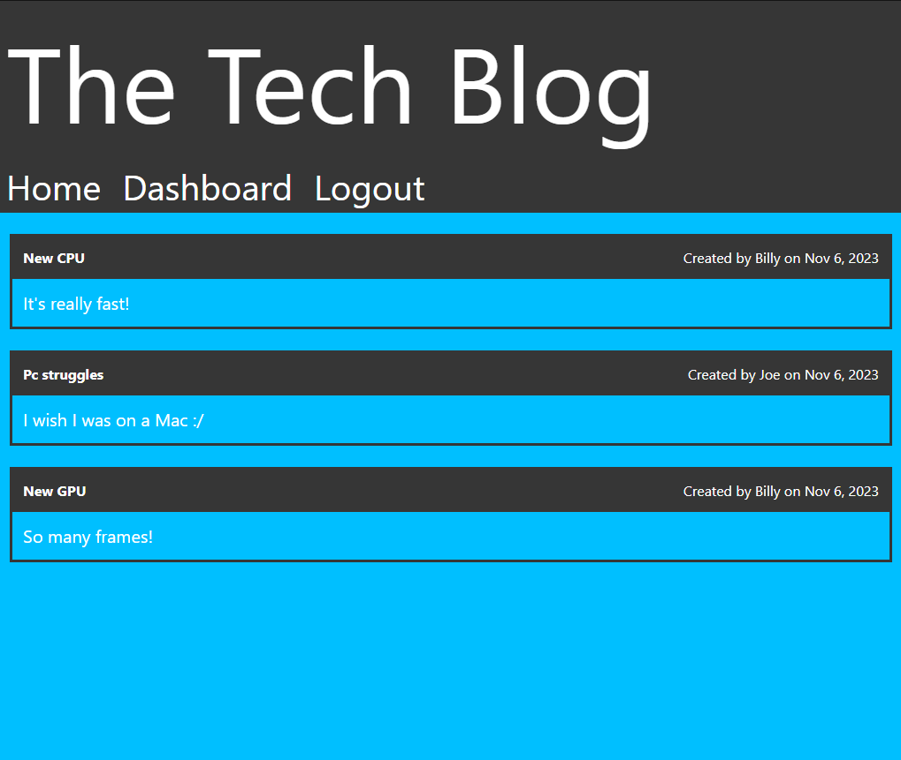
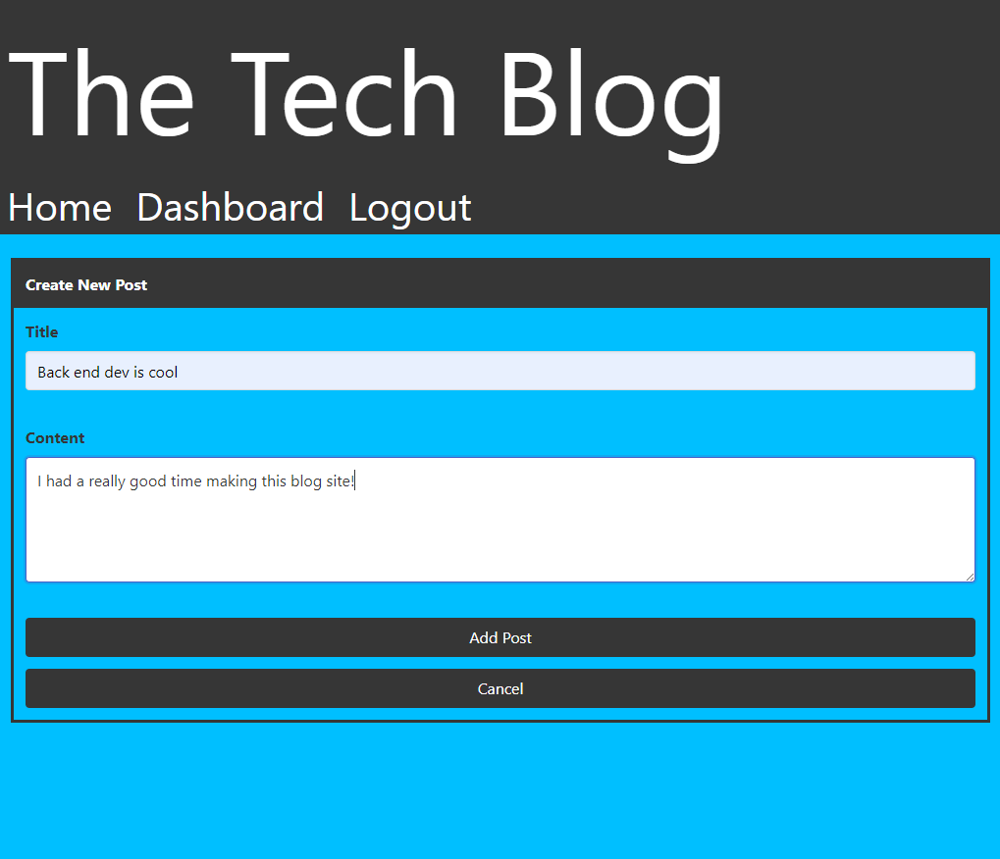
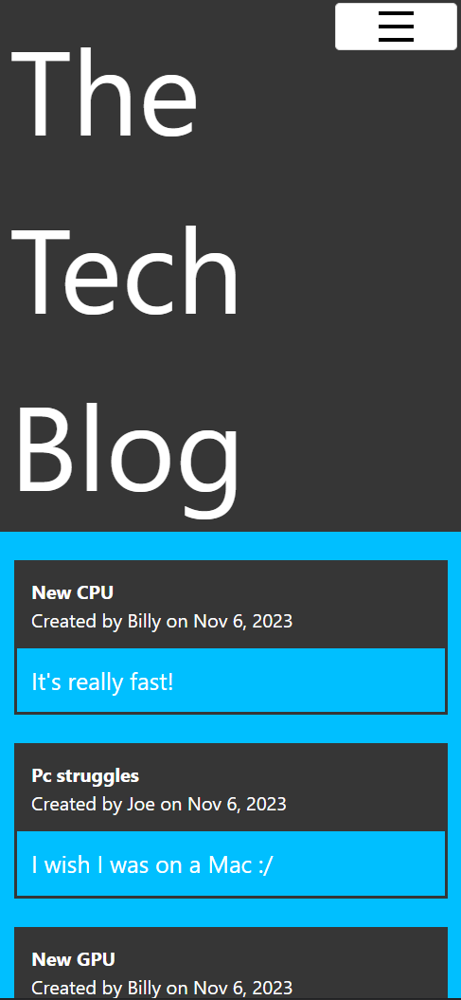

# Tech Blog

## Description

The purpose of this repo is to make a CMS-style blog focused on tech! It's a place where a user can view other blogs and comments, and even add their own posts and comments once signed up and logged in. This website is optimized for both mobile and desktop screens. The homepage shows all the blog posts on the website, the dashboard shows the logged in user's own posts, and clicking on a post will show the comments on a blog post.

Deployed website: [The Tech Blog](https://tech-blog-nathangero-142ac22ce678.herokuapp.com)

### Tech Stack and Why

|Tech|Docs|
|:-|:-:|
| Javascript | [docs](https://developer.mozilla.org/en-US/docs/Web/JavaScript) |
| CSS | [docs](https://developer.mozilla.org/en-US/docs/Web/CSS) |
| Bulma framework | [docs](https://bulma.io/documentation/) |
| Express JS | [docs](https://expressjs.com) |
| Express Handlebars | [docs](https://www.npmjs.com/package/express-handlebars) |
| Handlebars | [docs](https://handlebarsjs.com) |
| Express Session | [docs](https://expressjs.com/en/resources/middleware/session.html) |
| Sequelize v6 | [docs](https://sequelize.org/docs/v6/) |
| Bcrypt | [docs](https://www.npmjs.com/package/bcrypt) |
| Heroku | [docs](https://devcenter.heroku.com/) |

I wanted to create a full-stack web application and deploy it to a server, and in this case it's Heroku. Using Express.js to send/retreive data from the JAWSDB SQL via an api endpoint was nice and simple, and then calling `res.render()` with that data to go to a webpage was simple too.

Using handlebars to render the pages also made it nice and simple to direct the user to certain pages. Using handlebars' helps modularize the code with its use of partials and helper functions like `{{#each}}`. I used `res.render()` from the server and `document.location.replace()` from JavaScript files to move the user to specific pages depending on what they were doing.

Examples:
- When the user clicks on Dashboard but isn't logged in, the click sends a request to the server where it checks if the user is logged in or not. If they're logged in, the server directs them the Dashboard page, if not then they'll be redirected to the Login page.
- When a logged in user adds a comment, the server will send back a `200` response instead of a webpage to render. This is because the page where the comment was added doesn't change. So, when the JavaScript function that called the api endpoint receives a `200` response, it will just reload the page.

## Database Breakdown

There are 3 tables/models I defined:

| User | |
|-|-|
| id | int, not null, auto increment primary key |
| username | string, not null |
| password | string, not null |

| Post | |
|-|-|
| id | int, not null, auto increment primary key |
| title | string, not null |
| content | string, not null |
| user_id | string, not null, references to User |

| Comment | |
|-|-|
| id | int, not null, auto increment primary key |
| content | string, not null |
| user_id | string, not null, references to User |
| post_id | string, not null, references to Post |


### Relationships
- A User has many Posts and Comments
- A Post has many Comments
- A Post belongs to a User
- A Comment belongs to a User

## Usage

On the website you can do the following:
- View blog posts and comments on any blog
- Sign Up
- Log in. Below is what's available after logging in
  - View your blog posts
  - Update or delete your blog posts
  - Comment on other blog posts
  - Logout

When making or updating a post, you must fill out both the Title and Content fields.

When making a comment, you must fill the Content field.

## Learning Points

* Using `sequelize.literal()` and knowing how the JSON is returned is so important. When getting all Posts and their Comments, I wanted to get the username for each comment. I used `sequelize.literal()` but the WHERE clause wouldn't work until I did `WHERE comments.user_id`. I was doing `comment.user_id` and not realizing that the JSON response had the Post's comments listed as `comments` as opposed to `comment`. This caused a lot of headache, but I know now how it works! You can see my code [below](#nested-eager-loading)
* Using [Bulma](https://bulma.io/documentation/) was easier to work with than Bootstrap surprisingly enough. I had used Bulma in a previous project called [Food Finder](https://github.com/FenriRagni/food-finder), but I didn't think much of it outside of "let's try another framework." In my opinion, the Bulma class names are much easier to understand and memorize, despite their long nature. That's ultimately why I used Bulma in this project than Bootstrap.
* If two elements share the same HTML id, they can**NOT** share the same event listener. Only the first one delcared in the HTML will get the listener attached. So, I had to create two different ids for the Logout button.
* Using `role="button"` tag for a `<a>` tag is really helpful for navigation bars. It let me keep the style of the nav bar elements but giving me the attributes of a button like `.addEventListener`
* Using Heroku's JAWSDB was very easy to deploy to! Once I set it up in my Heroku project's settings, I just added this code and it all worked!
```js
if (process.env.JAWSDB_URL) {
    sequelize = new Sequelize(process.env.JAWSDB_URL);
}
```

## Code Snippets

### Nested Eager Loading

Nested `findAll()` call to get all Posts with their Comments, and the Comments with the User that created them.
```js
const data = await Post.findAll({
    include: [
        {
            model: Comment,
            attributes: [
                "id",
                "content",
                "createdAt",
                [sequelize.literal(
                    `(SELECT user.username FROM user WHERE comments.user_id = user.id)`
                ), "comment_author"],
            ]
        },
    ],
    attributes: [
        "id",
        "title",
        "content",
        "createdAt",
        "updatedAt",
        [sequelize.literal(
            `(SELECT user.username FROM user WHERE post.user_id = user.id)`
        ), "post_author"],
    ]
});
```

### Custom Handlebar Helper

Using custom handlebar helpers to show if a user can add a comment to a post
```js
canAddComment(isLoggedIn, fromHomepage) {
    return isLoggedIn && fromHomepage;
}
```

```handlebars
{{#if (canAddComment loggedIn fromHomepage)}}
  <button id="button-make-comment" class="button">Add Comment</button>
{{/if}}
```

## Images

Homepage on desktop screen



<br>
New Post screen



<br>
Homepage on mobile screen




## Future Ideas

- Adding a click count to each post. So, adding a new column in the db to account for the amount of times a blog has been clicked on.
- Showing how many comments a blog post has on the Homepage and Dashboard

## Key Takeaway 

Full-stack web development is fun! I had a blast making this even though it was really frustrating at times. Using express.js with handlebars to render webpages from a server was pretty interesting, and makes me think how big production websites work. I know there's a multitude of tech stack combinations out there, and I'm interested in learning more of them!

## Credits

[Sequelize nested eager loading](https://stackoverflow.com/a/33944634)

[Passing in a parameter in event listener](https://plainenglish.io/blog/passing-arguments-to-event-listeners-in-javascript-1a81bc397ecb)

[Using .svg file as favicon](https://medium.com/swlh/are-you-using-svg-favicons-yet-a-guide-for-modern-browsers-836a6aace3df)

[My SVG Generator](https://github.com/nathangero/svg-logo-maker)

### Resources

[cookie secure help](https://stackoverflow.com/questions/40324121/express-session-secure-true)

[Potential heroku cookie secure](https://stackoverflow.com/a/63105481)

[Bulma colors](https://bulma.io/documentation/helpers/color-helpers/)